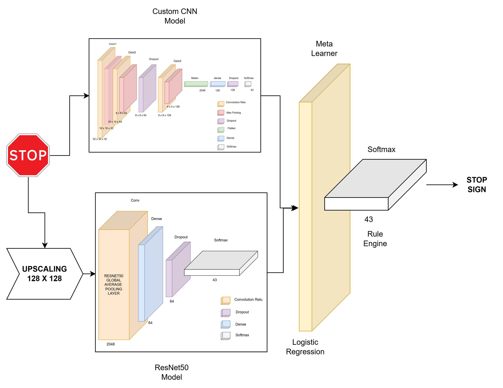

# GTSRB Traffic Sign Recognition Project
  
> **Author: Rishab Hanamar**  

---

## 1. Project Overview

**Project Title:**  
**Traffic Sign Recognition Model**

**Problem Statement:**  
Accurate recognition of traffic signs is essential for road safety and autonomous driving systems. Real-world conditions such as varying illumination, weather, and sign appearance make this a challenging computer vision problem.

**Objective:**  
To build and evaluate a CNN-based traffic sign recognition model using the GTSRB dataset that can classify images into 43 traffic sign categories with high accuracy.

---

## 2. Dataset

**Dataset Name:** German Traffic Sign Recognition Benchmark (GTSRB)

**Source:**
https://www.kaggle.com/datasets/meowmeowmeowmeowmeow/gtsrb-german-traffic-sign

**Number of Classes:** 43

**Image Size Used:** 32 x 32

**Class Distribution Handling:**  
Class imbalance was mitigated using shuffled and balanced mini-batches during training.

---

## 3. Project Structure

```
project_root/
│
├── data/
│   ├── train/
│   ├── test/
│   └── processed/
│
├── traffic-sign-dectection-models.ipynb.ipynb
├── traffic-sign-detection-metalearner_main.ipynb
├── traffic_sign_detection_RQs.ipynb
│
├── models/
│    ├── complete_models
│    │    ├── custom_cnn
│    │    │    └── custom_cnn_model.h5
│    │    ├── meta_learner
│    │    │    └── meta_learner_model.h5
│    │    └── resnet50
│    │         └── resnet50_model.h5
│    └── weights    
│         ├── custom_cnn
│         │    └── custom_cnn_model_weights.weights.h5
│         ├── meta_learner
│         │    └── meta_learner_model.weights.h5
│         └── resnet50
│              └── resnet50_weights.weights.h5
│
├── outputs/
│   ├── Figures/ _<Contains figures from Rearch Questions>
│   ├── Tables/  <Contains tables from Rearch Questions>
│   └── <Contains useful pdf of models and dataset>
│
└── README.md
```
## Model Architecture



## 4. Requirements
```
Python: 3.13.9
```

## 5. How to Run the Project

```

Step 1: Copy the data set from the link provide above and unzip it in the contents folder with the folder name gtsrb. It should follow the above folder structure

Step 2: Update/Check the paths in all the notebooks. DATASET_PATH

Step 3:Run the notebook "traffic-sign-dectection-models.ipynb.ipynb" Here the two sepearte models for Custom CNN "custom_cnn_model.h5" and ResNet50 *resnet50_model.h5* are created. It is saved in the folder outputs in the completed_models directory

Step 4:Run the Meta Learner Notebook "traffic-sign-detection-metalearner_main.ipynb" which uses the models created in the step 1 and generates the complete model "meta_learner_model.weights.h5"

Step 5: Run the Notebook for All RQs "traffic_sign_detection_RQs.ipynb" which will create the required tables and figures which support each of the Research Questions


```

## 6. References

```
Refer to the report at the location "" for full details about the model. Architecture, ML Pipeline, Research Questions are all provided in it.
```
